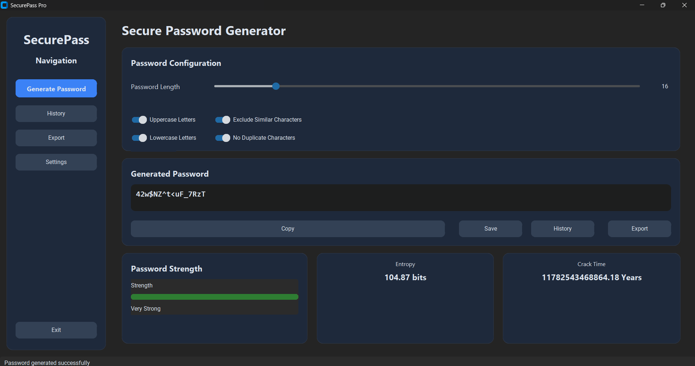

# 🔐 SecurePass Pro – Professional Random Password Generator

A modern **Random Password Generator** built with **Python** and **CustomTkinter** featuring password generation, strength analysis, entropy calculation, history management, clipboard support, export functionality, and a modern desktop interface.

This project demonstrates **object-oriented programming**, **modular software architecture**, **GUI development**, **file handling**, and **secure password generation**, making it suitable for academic submissions, internships, and software engineering portfolios.

---

# 📌 Features

### 🔑 Password Generation

* Generate highly secure random passwords
* Password length from **8–64 characters**
* Uppercase letters
* Lowercase letters
* Numbers
* Symbols
* Exclude similar characters
* Prevent duplicate characters

---

### 🛡 Password Strength Analysis

* Password strength meter
* Entropy calculation
* Estimated crack time
* Security rating
* Real-time strength updates

---

### 📋 Clipboard Support

* One-click password copy
* Automatic clipboard clearing
* Adjustable clipboard timeout
* Auto-copy generated password

---

### 📜 Password History

* Save generated passwords
* Search history
* Delete individual passwords
* Clear all history
* View strength information
* View entropy
* View creation date and time

---

### 📤 Export Functionality

Export password history in:

* CSV
* JSON
* TXT

---

### ⚙ Settings

* Dark Theme
* Light Theme
* System Theme
* Default password length
* Default generation options
* Clipboard timeout
* Auto-copy option
* Restore default settings

---

### 🖥 Modern Interface

* CustomTkinter UI
* Responsive desktop layout
* Professional dashboard
* Sidebar navigation
* Statistics cards
* Smooth user experience

---

# 🛠 Tech Stack

| Technology    | Purpose              |
| ------------- | -------------------- |
| Python 3      | Programming Language |
| CustomTkinter | Modern Desktop GUI   |
| Pyperclip     | Clipboard Support    |
| Pandas        | Data Export          |
| JSON          | History Storage      |
| CSV           | Export Format        |
| unittest      | Testing              |

---

# 📁 Project Structure

```text
Random-Password-Generator/
│
├── src/
│   ├── app.py
│   ├── main.py
│   ├── generator.py
│   ├── strength.py
│   ├── entropy.py
│   ├── clipboard.py
│   ├── history.py
│   ├── exporter.py
│   ├── settings.py
│   ├── theme.py
│   ├── validator.py
│   ├── logger.py
│   ├── constants.py
│   ├── utils.py
│   └── ui/
│       ├── home.py
│       ├── history_page.py
│       ├── settings_page.py
│       └── widgets.py
│
├── tests/
│   ├── test_generator.py
│   ├── test_strength.py
│   └── test_history.py
│
├── assets/
│   └── screenshots/
│
├── data/
│
├── exports/
│
├── requirements.txt
├── LICENSE
├── README.md
└── .gitignore
```

---

# 📸 Screenshots

## 🏠 Home Dashboard



---

## 🔑 Password Generation


---

## 📊 Password Strength


---

## 📜 Password History


---

## ⚙ Settings


---

## 📤 Export History


---

# ⚙ Installation

Clone the repository

```bash
git clone https://github.com/yourusername/Random-Password-Generator.git
```

Move into the project directory

```bash
cd Random-Password-Generator
```

Install the required packages

```bash
pip install -r requirements.txt
```

Run the application

```bash
python src/main.py
```

---

# 🚀 How to Use

1. Launch the application.
2. Choose the password length.
3. Enable or disable the required character types.
4. Click **Generate Secure Password**.
5. Review the strength analysis.
6. Copy or save the password.
7. Export history whenever required.

---

# 🧪 Running Tests

Run all unit tests

```bash
python -m unittest discover tests
```

or

```bash
pytest
```

---

# 📊 Password Security Metrics

The application analyzes every generated password using:

* Password Length
* Character Diversity
* Entropy
* Estimated Crack Time
* Strength Score

Security levels:

* 🔴 Very Weak
* 🟠 Weak
* 🟡 Medium
* 🟢 Strong
* 🟢 Very Strong

---

# 📂 Export Formats

The application supports exporting password history as:

* CSV
* JSON
* TXT

Exported files are automatically stored inside the **exports/** directory.

---

# 🏗 Software Architecture

The project follows a modular architecture.

```
main.py
      │
      ▼
app.py
      │
      ▼
home.py
      │
 ┌────┼─────────────────────────────┐
 ▼    ▼      ▼      ▼      ▼
generator.py
strength.py
history.py
settings.py
exporter.py
clipboard.py
```

---

# ✨ Future Improvements

* Password Generator Profiles
* QR Code Sharing
* Password Encryption
* Password Categories
* Cloud Backup
* Multi-language Support
* Biometric Authentication
* Automatic Password Expiry
* Password Leak Detection API
* Secure Password Vault

---

# 👨‍💻 Author

**Jai Krithik**

B.Tech – Artificial Intelligence & Data Science

Python Developer | AI & Data Science Enthusiast

---

# 📄 License

This project is licensed under the **MIT License**.

---

# ⭐ Support

If you found this project helpful:

⭐ Star the repository

🍴 Fork the project

🐛 Report issues

💡 Suggest improvements

Contributions and feedback are always welcome.
